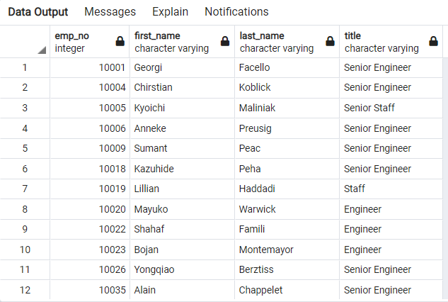
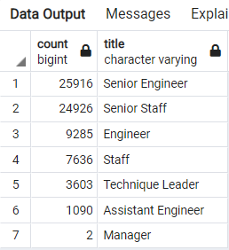
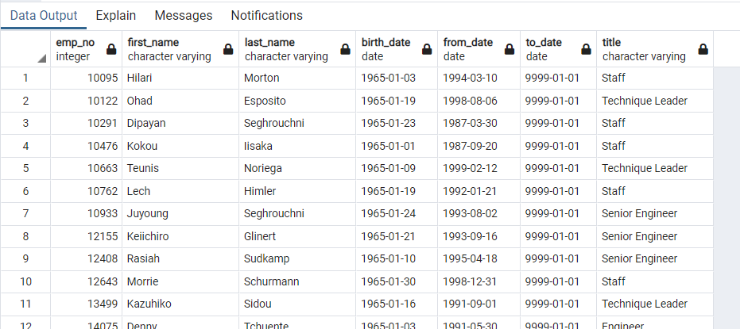

# Overview 

As we start to near the end of compiling data for Pewlett Hacker we are asked to put together two more csv files that contain the number of retiring employees based on their titles and employees who are eligable for the mentorship program. By providing this information to the manager he will be able to come up with a better plan to replace all the retiring employees.

# Results 

We start to focus on the first part of our data which includes information on employees who are retiring based on their titels. As we look at the data we realise that there are currently 
133,777 employees who are elgible for retirement.

When we take a closer look we see that some of the employees show up in our csv files mutliple times and that is beacuse over the years of their employement they could have switched job titles or took early retirement. After we created a code to remove all the duplicates we came up with 72,458 current employees that are elgible to retire.

Next we look at the mentorship eligibility. With creating this csv file we can see how could be trained to replace some of the employees that are retiring. 

