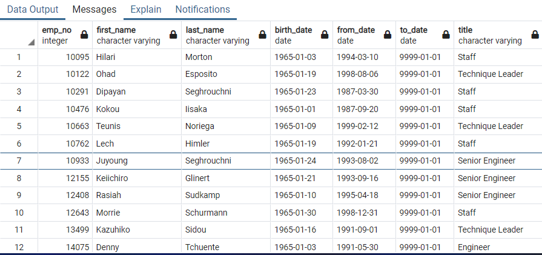

# Overview 

As we start to near the end of compiling data for Pewlett Hackard we are asked to put together two more csv files that contain the number of retiring employees based on their titles and employees who are eligible for the mentorship program. By providing this information to the manager he will be able to come up with a better plan to replace all the retiring employees.

# Results 

* We start to focus on the first part of our data which includes information on employees who are retiring based on their titles. 
As we look at the data we realize that there are currently 133,777 employees who are eligible for retirement. 

* When we take a closer look we see that some of the employees show up in our csv files multiple times and that is beacuse over the years of their employees could have switched job titles or took early retirement. After we created a code to remove all the duplicates nearly half of the employees were removed from the original list of 133,777.

* For us to have a better understanding we created a code to tell us exactly which titles will need the most attention. 

* Next, we look at the mentorship eligibility. With creating this csv file we can see how many current employees could be mentored to replace some of the employees that are retiring. While creating this code we had to focus on their birth date and when they started with the company. 

After running the code we get the current employees that are eligible for mentoring program that could lead them to a different department.  

# Summary 

When we look at our data from the retiring titles, we see that there are 72,458 employees who are retirement eligible. With this number being very high it’s going to take a lot of planning and data compiling to come up with a best solution.

 Looking at the first chart we can see that 25,916 Senior Engineers are eligible for retirement and only 528 can be replaced with our mentorship chart. 

It's very clear that there is a very limited number of employees who are eligible for the mentorship program. With only 1,549 employees on our new list, we have to focus on where the changes have to happen first. One of the ways to fix this issue was to write a code based on the employees hire date and who else could possibly be added to the mentorship program.

With refactored code we can gain 833 extra employees that could be added to our mentorship program. 

This may not be enough to replace all the employees that are retirement eligible but 2,382 employees is a great start. 

